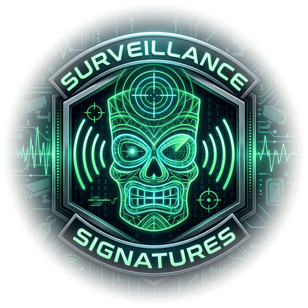

  

# Surveillance signatures

Identifiers that surveillance hardware broadcasts: **283 rows over nine tables**, each graded. Automatic number plate readers, fixed and body-worn cameras, smart glasses, item trackers, vehicle and fleet modules, gunshot sensors, pentest hardware and mesh nodes.

Everything here is a thing a device announces to anyone in range, over WiFi or Bluetooth Low Energy, without being asked. Nothing in this list requires connecting to anything, and nothing in it describes an attack.

**Not all of it is surveillance.** The `Mesh` rows are mesh radio nodes: a Meshtastic node, and the hubs that run a Zigbee network. They are here because knowing one is in range is worth something on its own, and because that is a different claim from a camera, which is why they carry their own kind rather than being filed as something they are not.

The Zigbee rows name the hub rather than the protocol, and the distinction matters: 802.15.4 is not readable by the hardware this list was built for. Each of those hubs also carries WiFi or BLE and announces itself there, so the network is findable by the thing running it even though its traffic is not.

Snapshot of 2026-10-07. Extracted from `ESP32-DIV/SpotterSignatures.h` in [magikh0e/pueo](https://github.com/magikh0e/pueo), which is GPL-3.0-or-later, so this carries the same licence.

| File | What it is |
| --- | --- |
| `README.md` | this, the whole list |
| `GRADING.md` | what the confidence levels mean and how to use them |
| `CONTRIBUTING.md` | what to send, what evidence settles it, what is out of scope |
| `signatures.csv` | one row per signature, flat |
| `signatures.json` | the same, grouped by table |
| `assets/` | the badge logo, and the social-preview card |

## What a match means, and what it does not

A row says a signature was **seen**, not that a device is doing anything. These are identifiers hardware broadcasts unprompted, so a match is evidence about what something is and not about how it is behaving.

**Almost none of this has been confirmed against the hardware it names.** One Flock reader raised the row it should have, on one device, on one occasion. Every other signature here is untested against the thing it claims to find. Treat the list as a set of leads, not as a set of findings.

An address prefix identifies whoever bought the block, which is often a contract manufacturer rather than the brand on the box. That is why the grading exists.

## How a match is graded

**Strong** belongs to one vendor's product and is not plausibly anything else. **Likely** fits, and could belong to something unrelated. **Weak** is corroboration only, typically a contract manufacturer whose silicon is in an enormous amount of ordinary consumer hardware.

Two differently labelled signatures on the same address promote Likely to Strong. They do not promote Weak, because two hints agreeing are still two hints.

That is the summary. **[GRADING.md](GRADING.md)** has the rest: the exact corroboration rule, what each level should do in front of a user, the traps in consuming this list, and how to pick a grade for a row you want to contribute.

## Kinds

| Kind | Meaning | Rows |
| --- | --- | --- |
| `Alpr` | Automatic number plate reader | 64 |
| `Bodycam` | Body-worn camera | 17 |
| `Camera` | Fixed camera | 59 |
| `Glasses` | Smart glasses | 5 |
| `Vehicle` | Vehicle or fleet module | 73 |
| `Tracker` | Item tracker | 8 |
| `Accessory` | Accessory or wearable | 24 |
| `Pentest` | Pentest hardware | 17 |
| `Mesh` | Mesh radio node | 9 |
| `Acoustic` | Gunshot detection sensor | 7 |

## Fixed addresses

`kMacSigs`, 1 row. The whole six-byte address is the signature. WiFi only: every address this table can hold is locally administered, which is what makes it a made-up address.

| Address | Kind | Conf | Label |
| --- | --- | --- | --- |
| `de:ad:be:ef:de:ad` | Pentest | Strong | Pwnagotchi |

## WiFi address prefixes

`kOuiSigs`, 126 rows. The first three bytes of a source address, which IEEE assigns to a manufacturer. Matched against BLE addresses too, but only where the entry is Strong and the advertised address is public.

| OUI | Kind | Conf | Label |
| --- | --- | --- | --- |
| `28:ea:5b` | Vehicle | Strong | Samsara fleet |
| `fc:db:21` | Vehicle | Strong | Samsara fleet |
| `98:5d:46` | Vehicle | Strong | PeopleNet ELD |
| `00:17:1a` | Vehicle | Strong | Winegard RV |
| `cc:57:63` | Vehicle | Weak | CarPlay dongle? |
| `68:8f:c9` | Vehicle | Weak | CarPlay dongle? |
| `00:0e:a5` | Alpr | Strong | BLIP Systems |
| `00:18:29` | Alpr | Strong | Gatsometer |
| `00:30:7e` | Alpr | Strong | Redflex |
| `00:14:7b` | Alpr | Strong | Iteris (BlueTOAD) |
| `d4:11:d6` | Acoustic | Strong | ShotSpotter |
| `14:ba:88` | Camera | Strong | Uniview |
| `48:ea:63` | Camera | Strong | Uniview |
| `6c:f1:7e` | Camera | Strong | Uniview |
| `88:26:3f` | Camera | Strong | Uniview |
| `c4:79:05` | Camera | Strong | Uniview |
| `00:23:bd` | Bodycam | Strong | Digital Ally |
| `00:09:bc` | Bodycam | Strong | Utility BodyWorn |
| `00:16:ed` | Bodycam | Strong | Utility BodyWorn |
| `00:1d:96` | Bodycam | Strong | WatchGuard Video |
| `fc:01:9e` | Bodycam | Strong | VIEVU |
| `48:46:8d` | Bodycam | Strong | Zepcam |
| `00:1b:be` | Bodycam | Strong | ICOP Digital |
| `00:1c:3f` | Bodycam | Strong | Intl Police Tech |
| `38:43:69` | Vehicle | Strong | Patrol upfit (PPC) |
| `6c:18:11` | Vehicle | Likely | Decatur radar |
| `00:30:44` | Accessory | Strong | Cradlepoint |
| `00:e0:1c` | Accessory | Strong | Cradlepoint |
| `00:14:3e` | Accessory | Strong | Sierra AirLink |
| `00:a0:d5` | Accessory | Strong | Sierra AirLink |
| `28:a3:31` | Accessory | Strong | Sierra AirLink |
| `50:13:9d` | Accessory | Strong | Sierra AirLink |
| `64:ce:6e` | Accessory | Strong | Sierra AirLink |
| `84:db:2f` | Accessory | Strong | Sierra AirLink |
| `cc:93:4a` | Accessory | Strong | Sierra AirLink |
| `28:80:a2` | Accessory | Weak | Inseego (MiFi?) |
| `00:40:29` | Accessory | Weak | Compex (shared board?) |
| `00:80:48` | Accessory | Weak | Compex (shared board?) |
| `04:f0:21` | Accessory | Weak | Compex (shared board?) |
| `04:0d:84` | Alpr | Weak | SiLabs (ALPR?) |
| `1c:34:f1` | Alpr | Weak | SiLabs (ALPR?) |
| `38:5b:44` | Alpr | Weak | SiLabs (ALPR?) |
| `94:34:69` | Alpr | Weak | SiLabs (ALPR?) |
| `b4:e3:f9` | Alpr | Weak | SiLabs (ALPR?) |
| `f0:82:c0` | Alpr | Weak | SiLabs (ALPR?) |
| `48:62:64` | Camera | Strong | Arlo |
| `a4:11:62` | Camera | Strong | Arlo |
| `fc:9c:98` | Camera | Strong | Arlo |
| `b4:1e:52` | Alpr | Strong | Flock Safety |
| `00:03:7f` | Alpr | Weak | Atheros QCA9377 |
| `00:25:df` | Bodycam | Strong | Axon Enterprise |
| `00:f4:8d` | Alpr | Weak | Liteon (ALPR?) |
| `14:5a:fc` | Alpr | Weak | Liteon (ALPR?) |
| `14:b5:cd` | Alpr | Weak | Liteon (ALPR?) |
| `24:b2:b9` | Alpr | Weak | Liteon (ALPR?) |
| `3c:91:80` | Alpr | Weak | Liteon (ALPR?) |
| `58:00:e3` | Alpr | Weak | Liteon (ALPR?) |
| `5c:93:a2` | Alpr | Weak | Liteon (ALPR?) |
| `64:6e:69` | Alpr | Weak | Liteon (ALPR?) |
| `70:08:94` | Alpr | Weak | Liteon (ALPR?) |
| `70:c9:4e` | Alpr | Weak | Liteon (ALPR?) |
| `74:4c:a1` | Alpr | Weak | Liteon (ALPR?) |
| `80:30:49` | Alpr | Weak | Liteon (ALPR?) |
| `94:08:53` | Alpr | Weak | Liteon (ALPR?) |
| `9c:2f:9d` | Alpr | Weak | Liteon (ALPR?) |
| `b8:1e:a4` | Alpr | Weak | Liteon (ALPR?) |
| `c0:35:32` | Alpr | Weak | Liteon (ALPR?) |
| `d0:39:57` | Alpr | Weak | Liteon (ALPR?) |
| `d8:f3:bc` | Alpr | Weak | Liteon (ALPR?) |
| `e0:0a:f6` | Alpr | Weak | Liteon (ALPR?) |
| `e4:aa:ea` | Alpr | Weak | Liteon (ALPR?) |
| `e8:d0:fc` | Alpr | Weak | Liteon (ALPR?) |
| `f4:6a:dd` | Alpr | Weak | Liteon (ALPR?) |
| `f8:a2:d6` | Alpr | Weak | Liteon (ALPR?) |
| `58:8e:81` | Alpr | Weak | SiLabs (ALPR?) |
| `90:35:ea` | Alpr | Weak | SiLabs (ALPR?) |
| `ec:1b:bd` | Alpr | Weak | SiLabs (ALPR?) |
| `3c:71:bf` | Alpr | Weak | Espressif (ALPR?) |
| `a4:cf:12` | Alpr | Weak | Espressif (ALPR?) |
| `08:3a:88` | Alpr | Weak | USI (ALPR?) |
| `e0:4f:43` | Alpr | Weak | USI (ALPR?) |
| `48:27:ea` | Alpr | Weak | Samsung (ALPR?) |
| `82:6b:f2` | Alpr | Weak | LAA, not a vendor |
| `00:04:7d` | Vehicle | Likely | Motorola Solutions |
| `00:18:85` | Vehicle | Likely | Motorola Solutions |
| `00:1f:92` | Vehicle | Likely | Motorola Solutions |
| `4c:cc:34` | Vehicle | Likely | Motorola Solutions |
| `b8:e2:8c` | Vehicle | Likely | Motorola Malaysia |
| `00:bf:15` | Alpr | Likely | Genetec |
| `0c:bf:15` | Alpr | Likely | Genetec |
| `ac:9f:c3` | Camera | Strong | Ring |
| `18:7f:88` | Camera | Strong | Ring |
| `34:3e:a4` | Camera | Strong | Ring |
| `54:e0:19` | Camera | Strong | Ring |
| `5c:47:5e` | Camera | Strong | Ring |
| `64:9a:63` | Camera | Strong | Ring |
| `90:48:6c` | Camera | Strong | Ring |
| `9c:76:13` | Camera | Strong | Ring |
| `cc:3b:fb` | Camera | Strong | Ring |
| `c4:db:ad` | Camera | Strong | Ring |
| `24:2b:d6` | Camera | Strong | Ring |
| `00:b4:63` | Camera | Strong | Ring |
| `50:e4:67` | Camera | Strong | Ring |
| `c0:56:e3` | Camera | Strong | Hikvision |
| `44:19:b6` | Camera | Strong | Hikvision |
| `28:57:be` | Camera | Strong | Hikvision |
| `2c:aa:8e` | Camera | Strong | Wyze Labs |
| `d0:3f:27` | Camera | Strong | Wyze Labs |
| `7c:78:b2` | Camera | Strong | Wyze Labs |
| `00:40:8c` | Camera | Strong | Axis Comms |
| `b8:a4:4f` | Camera | Strong | Axis Comms |
| `e0:a7:00` | Camera | Strong | Verkada |
| `70:1a:d5` | Camera | Strong | Avigilon Alta |
| `34:d2:70` | Camera | Weak | Amazon (Ring parent) |
| `f0:27:2d` | Camera | Weak | Amazon (Ring parent) |
| `fc:65:de` | Camera | Weak | Amazon (Ring parent) |
| `68:37:e9` | Camera | Weak | Amazon (Ring parent) |
| `b8:d7:af` | Camera | Weak | Murata (module) |
| `00:e0:4c` | Camera | Weak | Realtek (module) |
| `a4:c1:38` | Camera | Weak | Telink (module) |
| `4c:69:05` | Camera | Weak | unregistered OUI |
| `0c:fa:22` | Pentest | Strong | Flipper Devices |
| `02:c0:ca` | Pentest | Weak | Hak5 LAA default |
| `02:13:37` | Pentest | Weak | Hak5 LAA default |
| `00:c0:ca` | Pentest | Weak | ALFA (Pineapple radio?) |
| `de:ad:be` | Pentest | Weak | deadbeef MAC |
| `b8:35:32` | Alpr | Weak | unregistered OUI |
| `00:17:88` | Mesh | Likely | Philips Hue (Zigbee) |
| `ec:b5:fa` | Mesh | Likely | Philips Hue (Zigbee) |
| `c4:29:96` | Mesh | Likely | Signify Hue (Zigbee) |
| `fc:26:8c` | Mesh | Likely | Signify Hue (Zigbee) |
| `24:fd:5b` | Mesh | Likely | SmartThings hub |
| `18:c2:3c` | Mesh | Likely | Aqara/Lumi gateway |
| `54:ef:44` | Mesh | Likely | Aqara/Lumi gateway |
| `68:ec:8a` | Mesh | Likely | IKEA smart home hub |

## WiFi network names

`kSsidSigs`, 5 rows. Matched case-insensitively from the start of an SSID in a probe request or a beacon. A length, where given, means the name must be exactly that long.

| Prefix | Len | Kind | Conf | Label |
| --- | --- | --- | --- | --- |
| `Penguin-` |  | Accessory | Likely | Flock battery pack |
| `FS Ext Battery` |  | Accessory | Strong | Flock ext battery |
| `Ray-Ban` |  | Glasses | Strong | Ray-Ban Meta |
| `Spectacles` |  | Glasses | Strong | Snap Spectacles |
| `DfuTarg` |  | Accessory | Weak | Nordic DFU (generic) |
| `QT ` | `11` | Vehicle | Likely | KARR BT module |
| `DR ` | `11` | Vehicle | Likely | KARR Cell module |

## Names matched anywhere

`kNameInSigs`, 78 rows. Found anywhere in a name rather than at the start, because people rename the front of these. A length, where given, is a minimum the name must reach.

| Needle | Min | Kind | Conf | Label |
| --- | --- | --- | --- | --- |
| `Samsara` |  | Vehicle | Strong | Samsara fleet |
| `KeepTruckin` |  | Vehicle | Strong | Motive ELD |
| `Motive Hotspot` |  | Vehicle | Strong | Motive ELD |
| `Motive_` |  | Vehicle | Strong | Motive ELD |
| `PNet` |  | Vehicle | Likely | PeopleNet ELD |
| `tsTPMS` |  | Vehicle | Strong | Tesla tyre sensor |
| `TireCheck` |  | Vehicle | Strong | TireCheck TPMS |
| `TPMS` |  | Vehicle | Likely | TPMS sensor |
| `FOBO` |  | Vehicle | Likely | FOBO TPMS |
| `TeslaWallConnector` |  | Vehicle | Weak | Tesla charger |
| `Cybertruck` |  | Vehicle | Weak | Tesla |
| `TeslaGW` |  | Vehicle | Weak | Tesla |
| `myChevrolet` |  | Vehicle | Weak | Chevrolet |
| `myCadillac` |  | Vehicle | Weak | Cadillac |
| `myBuick` |  | Vehicle | Weak | Buick |
| `myGMC` |  | Vehicle | Weak | GMC |
| `Uconnect` |  | Vehicle | Weak | Stellantis Uconnect |
| `Porsche_WLAN` |  | Vehicle | Weak | Porsche |
| `Audi_MMI_` |  | Vehicle | Weak | Audi MMI |
| `MBUX` |  | Vehicle | Weak | Mercedes MBUX |
| `CARLINK-` |  | Vehicle | Weak | CarPlay adapter |
| `CarPlay` |  | Vehicle | Weak | CarPlay head unit |
| `Winegard` |  | Vehicle | Weak | Winegard RV |
| `BlipTrack` |  | Alpr | Strong | BlipTrack |
| `BLIP-Track` |  | Alpr | Strong | BlipTrack |
| `BlueTOAD` |  | Alpr | Strong | BlueTOAD |
| `BlueARGUS` |  | Alpr | Strong | Iteris BlueARGUS |
| `VantageARGUS` |  | Alpr | Strong | Iteris VantageARGUS |
| `VantageVelocity` |  | Alpr | Strong | Iteris Vantage |
| `Vantage Velocity` |  | Alpr | Strong | Iteris Vantage |
| `TrafficCast` |  | Alpr | Strong | TrafficCast |
| `Miovision` |  | Alpr | Strong | Miovision |
| `Pigvision` |  | Camera | Strong | Pigvision |
| `ShotSpotter` |  | Acoustic | Strong | ShotSpotter |
| `Shot Spotter` |  | Acoustic | Strong | ShotSpotter |
| `SoundThinking` |  | Acoustic | Strong | SoundThinking |
| `LVT-` |  | Alpr | Strong | LVT trailer |
| `LVT_` |  | Alpr | Strong | LVT trailer |
| `LiveView` |  | Alpr | Likely | LVT trailer? |
| `Dahua` |  | Camera | Likely | Dahua |
| `Uniview` |  | Camera | Likely | Uniview |
| `Uniarch` |  | Camera | Likely | Uniview Uniarch |
| `UNV-` |  | Camera | Likely | Uniview |
| `UVC G3 Instant` |  | Camera | Strong | UniFi Protect |
| `UVC G4 Instant` |  | Camera | Strong | UniFi Protect |
| `UVC G6 Instant` |  | Camera | Strong | UniFi Protect |
| `FS Ext` |  | Accessory | Likely | FS pole battery |
| `PENGUIN` |  | Accessory | Weak | Penguin battery? |
| `Digital Ally` |  | Bodycam | Strong | Digital Ally |
| `DigitalAlly` |  | Bodycam | Strong | Digital Ally |
| `FirstVu` |  | Bodycam | Strong | Digital Ally FirstVu |
| `VuLink` |  | Bodycam | Strong | Digital Ally VuLink |
| `EVO-HD` |  | Bodycam | Likely | Digital Ally EVO-HD |
| `Cradlepoint` |  | Accessory | Strong | Cradlepoint |
| `AirLink` |  | Accessory | Likely | Sierra AirLink |
| `ARLO_VMB_` |  | Camera | Strong | Arlo base station |
| `Arlo` |  | Camera | Weak | Arlo? |
| `EufyCam` |  | Camera | Likely | eufy |
| `Nest Cam` |  | Camera | Likely | Nest Cam |
| `Nestcam` |  | Camera | Likely | Nest Cam |
| `Nest-Hello` |  | Camera | Likely | Nest doorbell |
| `Reolink` |  | Camera | Likely | Reolink |
| `Tapo` |  | Camera | Weak | TP-Link Tapo? |
| `Pineapple_` |  | Pentest | Strong | Hak5 Pineapple |
| `WiFi Pineapple` |  | Pentest | Strong | Hak5 Pineapple |
| `MarauderAP` |  | Pentest | Strong | ESP32 Marauder |
| `Marauder` |  | Pentest | Likely | ESP32 Marauder |
| `GhostESP` |  | Pentest | Strong | GhostESP |
| `Deauther` |  | Pentest | Likely | ESP8266 Deauther |
| `Rekor` |  | Alpr | Likely | Rekor (ALPR) |
| `Hayden` |  | Alpr | Likely | Hayden AI (ALPR) |
| `Avigilon` |  | Camera | Likely | Avigilon |
| `Wisenet` |  | Camera | Likely | Hanwha Wisenet |
| `Rhombus` |  | Camera | Likely | Rhombus |
| `i-PRO` |  | Camera | Likely | Panasonic i-PRO |
| `Wolfcom` |  | Bodycam | Likely | Wolfcom |
| `WatchGuard` |  | Bodycam | Likely | WatchGuard Video |
| `Reveal` | `8` | Bodycam | Weak | Reveal Media? |

## BLE company and service IDs

`kBleSigs`, 47 rows. A 16-bit manufacturer company ID, a 16-bit service UUID, or both. A blank means the field is not part of the rule.

| Company | Service | Kind | Conf | Label |
| --- | --- | --- | --- | --- |
| `0x0B6B` |  | Vehicle | Strong | Samsara fleet |
| `0x0601` |  | Vehicle | Strong | Schrader TPMS |
| `0x0B99` |  | Vehicle | Strong | Goodyear tyre |
| `0x0E32` |  | Vehicle | Strong | Pacific TPMS |
| `0x070A` |  | Vehicle | Strong | Huf tyre/PEPS |
| `0x0127` |  | Vehicle | Strong | FOBO TPMS |
| `0x0BA2` |  | Vehicle | Strong | TireCheck TPMS |
|  | `0x00EE` | Vehicle | Likely | FOBO TPMS |
|  | `0x27A5` | Vehicle | Likely | SYTPMS sensor |
|  | `0xFBB0` | Vehicle | Likely | Aftermarket TPMS |
|  | `0x1860` | Vehicle | Weak | TPMS service |
| `0x022B` |  | Vehicle | Weak | Tesla |
|  | `0xFE96` | Vehicle | Weak | Tesla |
|  | `0xFE97` | Vehicle | Weak | Tesla |
| `0x05EB` |  | Vehicle | Weak | BMW |
| `0x0723` |  | Vehicle | Weak | Ford/Lincoln |
| `0x0977` |  | Vehicle | Weak | Toyota/Lexus |
| `0x0915` |  | Vehicle | Weak | Honda/Acura |
| `0x0826` |  | Vehicle | Weak | Hyundai/Genesis |
| `0x0BA6` |  | Vehicle | Weak | Nissan/Infiniti |
| `0x0A10` |  | Vehicle | Weak | Subaru |
| `0x011F` |  | Vehicle | Weak | Volkswagen |
|  | `0xFE30` | Vehicle | Weak | Volkswagen |
|  | `0xFE31` | Vehicle | Weak | Volkswagen |
| `0x010E` |  | Vehicle | Weak | Audi |
| `0x0120` |  | Vehicle | Weak | Porsche |
| `0x017C` |  | Vehicle | Weak | Mercedes |
| `0x020B` |  | Vehicle | Weak | Jaguar/Land Rover |
| `0x0068` |  | Vehicle | Weak | GM |
| `0x0941` |  | Vehicle | Weak | Rivian |
| `0x0C34` |  | Vehicle | Weak | BYD |
| `0x09C8` |  | Accessory | Likely | Penguin battery |
| `0x0D53` | `0xFD5F` | Glasses | Strong | Meta Ray-Ban |
| `0x0D53` |  | Glasses | Likely | Luxottica eyewear |
|  | `0xFD5F` | Glasses | Likely | Meta device |
| `0x09C8` |  | Accessory | Likely | XUNTONG (Penguin) |
|  | `0xFEED` | Tracker | Strong | Tile |
|  | `0xFEEC` | Tracker | Strong | Tile |
|  | `0xFD5A` | Tracker | Likely | Samsung (SmartTag?) |
|  | `0xFEAA` | Tracker | Weak | Eddystone beacon |
|  | `0x3080` | Pentest | Likely | Flipper Zero |
|  | `0x3081` | Pentest | Likely | Flipper Zero (black) |
|  | `0x3082` | Pentest | Likely | Flipper Zero (white) |
|  | `0x3083` | Pentest | Likely | Flipper Zero (clear) |
|  | `0x3100` | Acoustic | Weak | Raven GATT 3100 |
|  | `0x3101` | Acoustic | Weak | Raven GATT 3101 |
|  | `0x3102` | Acoustic | Weak | Raven GATT 3102 |

## BLE advertised names

`kBleNameSigs`, 7 rows. Matched case-insensitively from the start of an advertised name.

| Prefix | Len | Kind | Conf | Label |
| --- | --- | --- | --- | --- |
| `Penguin-` |  | Accessory | Likely | Flock battery pack |
| `FS Ext Battery` |  | Accessory | Strong | Flock ext battery |
| `Ray-Ban` |  | Glasses | Strong | Ray-Ban Meta |
| `Spectacles` |  | Glasses | Strong | Snap Spectacles |
| `DfuTarg` |  | Accessory | Weak | Nordic DFU (generic) |
| `QT ` | 11 | Vehicle | Likely | KARR BT module |
| `DR ` | 11 | Vehicle | Likely | KARR Cell module |

## BLE 128-bit service UUIDs

`kBle128Sigs`, 2 rows. A service UUID somebody generated for their own protocol rather than an allocation out of the shared 16-bit space, which is why a hit here is worth more. Printed in the usual order, not the little-endian order they are stored in.

| UUID | Kind | Conf | Label |
| --- | --- | --- | --- |
| `6ba1b218-15a8-461f-9fa8-5dcae273eafd` | Mesh | Strong | Meshtastic node |
| `e8ccbb38-9532-46a8-9fe5-1814df172e6f` | Accessory | Strong | Flock accessory |

## BLE manufacturer data

`kMfgSigs`, 5 rows. A company ID plus the first bytes that follow it. Company 0x004C is every Apple device in range; the type byte after it is what makes one of them a Find My accessory.

| Company | Prefix | Kind | Conf | Label |
| --- | --- | --- | --- | --- |
| `0x0001` | `80` | Vehicle | Likely | TPMS (front L) |
| `0x0001` | `81` | Vehicle | Likely | TPMS (front R) |
| `0x0001` | `82` | Vehicle | Likely | TPMS (rear L) |
| `0x0001` | `83` | Vehicle | Likely | TPMS (rear R) |
| `0x004C` | `12` | Tracker | Likely | Apple Find My (separated) |

## BLE service data

`kSvcDataSigs`, 3 rows. A service UUID plus the first bytes of the data it carries. A Find My Device tag and a shop's beacon both advertise 0xFEAA; the frame type says which.

| Service | Prefix | Kind | Conf | Label |
| --- | --- | --- | --- | --- |
| `0xFEAA` | `40` | Tracker | Strong | Google Find My Device |
| `0xFEAA` | `41` | Tracker | Strong | Google Find My Device |
| `0xFCB2` |  | Tracker | Strong | DULT tracker |

## Corrections

A wrong row is worth more to fix than a missing one, because a wrong row names somebody. If a signature here is misattributed, or one you can evidence is missing, open an issue. Evidence beats a vendor name: a capture, a datasheet, a registry entry.

**[CONTRIBUTING.md](CONTRIBUTING.md)** has the rest, and one thing worth knowing before you start: the three data files are generated, so a pull request editing them is overwritten by the next regeneration. Signatures go in as issues. Everything that is not generated takes a pull request as normal.

A question, or something seen in the field you can't place, goes in [Discussions](https://github.com/magikh0e/surveillance-signatures/discussions) rather than an issue — Q&A and Show and tell are open. An issue is for a row that is wrong or a row that is missing, with evidence.

## Support

This list is built and maintained in my own time, from public broadcasts and open sources, with nothing to sell. If it is useful to you, a coffee is always appreciated and helps keep it going.

## Licence

GPL-3.0-or-later. See `LICENSE`.
